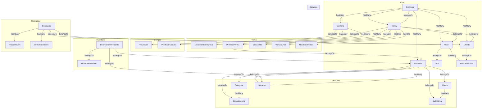

# Code Graph - ProjRoma (Análisis Completo)

## Resumen

| Dato | Valor |
|------|-------|
| **Nombre** | ProjRoma Facturación |
| **Framework** | Laravel 12.58.0 (PHP 8.3) |
| **Tipo** | Sistema de Facturación, Ventas y Almacén (SaaS multi-tenant) |
| **Integración** | Sunat (Greenter), PDF/DomPDF, Excel, DataTables |
| **Modelos** | 34 |
| **Controladores** | 25+ |
| **API Endpoints** | 58 |
| **Web Routes** | ~54 |
| **Middleware** | 3 custom |
| **Tablas DB** | 30+ |

---

## Arquitectura

```
┌──────────────────────────────────────────────────────────────┐
│  PRESENTACIÓN (Hybrid SPA)                                  │
│  ┌────────────┐  ┌────────────────┐  ┌────────────────────┐ │
│  │ Web Routes │  │  API Routes    │  │  PDF/Excel Reports │ │
│  │ (Blade)    │  │  (JSON/REST)   │  │  (DomPDF)          │ │
│  └────────────┘  └────────────────┘  └────────────────────┘ │
├──────────────────────────────────────────────────────────────┤
│  NEGOCIO                                                     │
│  ┌──────────────────┐  ┌──────────────┐  ┌────────────────┐ │
│  │ Controllers      │  │ FormRequests │  │ Middleware      │ │
│  │ (ALL logic here) │  │ (1 only)     │  │ (3 custom)     │ │
│  └──────────────────┘  └──────────────┘  └────────────────┘ │
├──────────────────────────────────────────────────────────────┤
│  DATOS                                                       │
│  ┌──────────────┐  ┌──────────────┐  ┌────────────────────┐ │
│  │ Eloquent ORM │  │ Factories    │  │ Migrations         │ │
│  │ (34 models)  │  │              │  │ (30+ tables)       │ │
│  └──────────────┘  └──────────────┘  └────────────────────┘ │
└──────────────────────────────────────────────────────────────┘
```

---

## Modelos (34) - Grafo de Relaciones



### Detalle de Cada Modelo

| Modelo | Tabla | PK | Relationships | Scopes |
|--------|-------|----|---------------|--------|
| **User** | `usuarios` | `usuario_id` | belongsTo: Empresa, Rol; hasMany: RutaVendedor | activos, deEmpresa, vendedores |
| **Empresa** | `empresas` | `id_empresa` | hasMany: User, Cliente, Producto | - |
| **Sucursal** | `sucursales` | `id_sucursal` | - | - |
| **Rol** | `roles` | `rol_id` | - | - |
| **Producto** | `productos` | `id_producto` | (SIN relationships definidos) | activos, deEmpresa, deSucursal, bajoStock |
| **Cliente** | `clientes` | `id_cliente` | belongsTo: Empresa, RutaVendedor; hasMany: Venta | deEmpresa, buscar |
| **Proveedor** | `proveedores` | `proveedor_id` | hasMany: Compra | - |
| **Venta** | `ventas` | `id_venta` | belongsTo: Cliente, Empresa, User, DocumentoEmpresa; hasMany: ProductoVenta, DiasVenta; hasOne: VentaSunat | deEmpresa, deSucursal, activas, delMes |
| **Compra** | `compras` | `id_compra` | belongsTo: Proveedor, DocumentoEmpresa, Empresa; hasMany: ProductoCompra | deEmpresa, delMes |
| **Cotizacion** | `cotizaciones` | `cotizacion_id` | belongsTo: Cliente, User; hasMany: ProductoCoti, CuotaCotizacion | deEmpresa, pendientes |
| **ProductoVenta** | `productos_ventas` | `id` | belongsTo: Venta, Producto | - |
| **ProductoCompra** | `productos_compras` | `id` | (SIN relationships) | - |
| **ProductoCoti** | `productos_cotis` | `id` | (SIN relationships) | - |
| **VentaSunat** | `ventas_sunat` | `id` | belongsTo: Venta | - |
| **NotaElectronica** | `notas_electronicas` | `id_nota` | belongsTo: Venta | - |
| **DevolucionNv** | `devoluciones_nv` | `id` | (SIN relationships) | - |
| **DiasVenta** | `dias_ventas` | `id` | belongsTo: Venta | - |
| **DiasCompra** | `dias_compras` | `id` | (SIN relationships) | - |
| **CuotaCotizacion** | `cuotas_cotizacion` | `id` | - | - |
| **DocumentoEmpresa** | `documentos_empresas` | `id_tido` | - | - |
| **RutaVendedor** | `rutas_vendedor` | `id_ruta` | - | - |
| **Categoria** | `categorias` | `id_categoria` | - | - |
| **Subcategoria** | `subcategorias` | `id_subcategoria` | - | - |
| **Marca** | `marcas` | `id_marca` | - | - |
| **Submarca** | `submarcas` | `id_submarca` | - | - |
| **ArqueoDiario** | `arqueos_diarios` | `arqueo_id` | - | - |
| **CajaEmpresa** | `caja_empresa` | `id` | (SIN relationships) | - |
| **Almacen** | `almacenes` | `id_almacen` | - | - |
| **MotivoMovimiento** | `motivos_movimiento` | `id_motivo` | - | - |
| **InventarioMovimiento** | `inventario_movimientos` | `id_movimiento` | (SIN relationships) | - |
| **IngresoEgreso** | `ingreso_egreso` | `id` | (SIN relationships) | - |
| **GuiaRemision** | `guia_remision` | `id_guia` | belongsTo: Cliente; hasMany: GuiaDetalle | - |
| **GuiaDetalle** | `guia_detalles` | `id` | (SIN relationships) | - |
| **Prestamo** | `prestamos` | `id_prestamo` | (SIN relationships) | - |

---

## Controladores

### API Controllers (Business Logic)

| Controller | Métodos | Modelos que usa | Líneas aprox |
|------------|---------|-----------------|--------------|
| **VentasApiController** | listar, guardar, anular, detalle, tipoVenta, buscarProducto, buscarProductoCoti, cargarVentaProductos, cargarVentaServicios, cargarVentaDetalles, editProducto, editServicio, ingresoAlmacen, egresoAlmacen, generarTextLibroVentas | Venta, ProductoVenta, DiasVenta, Producto, DocumentoEmpresa, Cliente, GuardarVentaRequest | ~263 |
| **ClientesApiController** | listar, render, insertar, insertarXLista, getOne, editar, borrar, buscarDatos | Cliente, DataTables | - |
| **ProductosApiController** | listar, serverside, catalogo, guardar, agregarPorLista, editar, borrar, getOne, porRazonSocial | Producto, DataTables, DB | - |
| **CatalogoApiController** | listar, guardar, editar, toggle, borrar | Categoria, Subcategoria, Marca, Submarca | - |
| **ComprasApiController** | listar | Compra, DataTables | - |
| **AlmacenApiController** | listar, guardar, editar, toggle, borrar | Almacen, DB | - |
| **MovimientoApiController** | listar, ajustes, motivos, productosAlmacen, guardar, traslado, anular | Producto, MotivoMovimiento, InventarioMovimiento, Almacen | - |
| **RecepcionApiController** | pendientes, recepcionar | Compra, Producto, MotivoMovimiento, InventarioMovimiento | - |
| **PrestamoApiController** | listar, guardar, devolver | Producto, Prestamo, MotivoMovimiento, InventarioMovimiento | - |
| **MotivoApiController** | listar, guardar, editar, toggle, borrar | MotivoMovimiento | - |
| **SucursalApiController** | listar, guardar, editar, toggle, borrar | Sucursal | - |
| **ArqueoApiController** | obtenerCobrosDia, guardar, get | ArqueoDiario, DB | - |

### Web Controllers (View shells)

| Controller | Métodos | Notas |
|------------|---------|-------|
| **LoginController** | showLogin, login, logout | Auth + rate limiting + sha1 auto-migration |
| **DashboardController** | index | KPIs: ventas, compras, clientes, stock bajo |
| **VentasController** | index, formProductos, formServicios, editarProducto, editarServicio, notaElectronica, notaElectronicaLista | Solo retorna vistas |
| **ComprasController** | index, create, pagos | Stub views |
| **ClientesController** | index, exportarExcel (stub), exportarClientesVisitaPdf (stub) | |
| **ProductosController** | index, create, recepcion, almacen, kardex, ajustes, traslado, prestamos, escanearBarra | |
| **CotizacionesController** | index, create, edit, cuotas | |
| **CobranzasController** | index, deudas, cuentasPorCobrar, misCobros, exportarExcel (stub) | |
| **CajaController** | registros, flujo, miCaja | |
| **ReportesController** | comprobanteVenta, comprobanteVentaMa4, voucher8cm, voucher56cm, + 15 stubs | PDF generation |
| **UsuariosController** | index, adminEmpresas | |
| **SucursalController** | index | |
| **ProveedoresController** | index | |
| **GuiaRemisionController** | index, create | |
| **DevolucionesController** | index, exportarExcel (stub) | |
| **ArqueoDiarioController** | index | |

---

## Rutas API (58 endpoints)

| Método | Endpoint | Controller@Método |
|--------|----------|-------------------|
| GET | `api/ventas/` | VentasApiController@listar |
| POST | `api/ventas/add` | VentasApiController@guardar |
| POST | `api/ventas/anular` | VentasApiController@anular |
| POST | `api/ventas/detalle` | VentasApiController@detalle |
| POST | `api/ventas/tipo` | VentasApiController@tipoVenta |
| POST | `api/ventas/productos/edit` | VentasApiController@editProducto |
| POST | `api/ventas/servicios/edit` | VentasApiController@editServicio |
| POST | `api/ventas/ingreso/almacen` | VentasApiController@ingresoAlmacen |
| POST | `api/ventas/egreso/almacen` | VentasApiController@egresoAlmacen |
| GET | `api/ventas/cargar/productos/{id}` | VentasApiController@buscarProducto |
| GET | `api/ventas/cargar/productos` | VentasApiController@buscarProductoCoti |
| POST | `api/ventas/cargar/venta/productos` | VentasApiController@cargarVentaProductos |
| POST | `api/ventas/cargar/venta/servicios` | VentasApiController@cargarVentaServicios |
| POST | `api/ventas/cargar/venta/info` | VentasApiController@cargarVentaDetalles |
| GET | `api/clientes/` | ClientesApiController@listar |
| POST | `api/clientes/add` | ClientesApiController@insertar |
| POST | `api/clientes/add/lista` | ClientesApiController@insertarXLista |
| POST | `api/clientes/render` | ClientesApiController@render |
| POST | `api/clientes/get-one` | ClientesApiController@getOne |
| POST | `api/clientes/editar` | ClientesApiController@editar |
| POST | `api/clientes/borrar` | ClientesApiController@borrar |
| GET | `api/clientes/buscar/datos` | ClientesApiController@buscarDatos |
| GET | `api/productos/` | ProductosApiController@listar |
| GET | `api/productos/serverside` | ProductosApiController@serverside |
| GET | `api/productos/catalogo` | ProductosApiController@catalogo |
| POST | `api/productos/add` | ProductosApiController@guardar |
| POST | `api/productos/add/lista` | ProductosApiController@agregarPorLista |
| POST | `api/productos/editar` | ProductosApiController@editar |
| POST | `api/productos/borrar` | ProductosApiController@borrar |
| POST | `api/productos/get-one` | ProductosApiController@getOne |
| GET | `api/productos/razon-social` | ProductosApiController@porRazonSocial |
| GET | `api/catalogo/{tipo}` | CatalogoApiController@listar |
| POST | `api/catalogo/{tipo}` | CatalogoApiController@guardar |
| POST | `api/catalogo/{tipo}/editar` | CatalogoApiController@editar |
| POST | `api/catalogo/{tipo}/toggle` | CatalogoApiController@toggle |
| POST | `api/catalogo/{tipo}/borrar` | CatalogoApiController@borrar |
| GET | `api/compras` | ComprasApiController@listar |
| GET | `api/almacenes/` | AlmacenApiController@listar |
| POST | `api/almacenes/` | AlmacenApiController@guardar |
| POST | `api/almacenes/editar` | AlmacenApiController@editar |
| POST | `api/almacenes/toggle` | AlmacenApiController@toggle |
| POST | `api/almacenes/borrar` | AlmacenApiController@borrar |
| GET | `api/movimientos/` | MovimientoApiController@listar |
| GET | `api/movimientos/ajustes` | MovimientoApiController@ajustes |
| GET | `api/movimientos/motivos` | MovimientoApiController@motivos |
| GET | `api/movimientos/productos` | MovimientoApiController@productosAlmacen |
| POST | `api/movimientos/` | MovimientoApiController@guardar |
| POST | `api/movimientos/traslado` | MovimientoApiController@traslado |
| POST | `api/movimientos/anular` | MovimientoApiController@anular |
| GET | `api/recepcion/pendientes` | RecepcionApiController@pendientes |
| POST | `api/recepcion/recepcionar` | RecepcionApiController@recepcionar |
| GET | `api/prestamos/` | PrestamoApiController@listar |
| POST | `api/prestamos/` | PrestamoApiController@guardar |
| POST | `api/prestamos/devolver` | PrestamoApiController@devolver |
| GET | `api/motivos/` | MotivoApiController@listar |
| POST | `api/motivos/` | MotivoApiController@guardar |
| POST | `api/motivos/editar` | MotivoApiController@editar |
| POST | `api/motivos/toggle` | MotivoApiController@toggle |
| POST | `api/motivos/borrar` | MotivoApiController@borrar |
| GET | `api/sucursales/` | SucursalApiController@listar |
| POST | `api/sucursales/` | SucursalApiController@guardar |
| POST | `api/sucursales/editar` | SucursalApiController@editar |
| POST | `api/sucursales/toggle` | SucursalApiController@toggle |
| POST | `api/sucursales/borrar` | SucursalApiController@borrar |
| POST | `api/arqueo/cobros-dia` | ArqueoApiController@obtenerCobrosDia |
| POST | `api/arqueo/guardar` | ArqueoApiController@guardar |
| POST | `api/arqueo/get` | ArqueoApiController@get |
| POST | `api/generar/txt/ventareporte` | VentasApiController@generarTextLibroVentas |

---

## Base de Datos (30+ tablas)

| Tabla | PK | FKs | Notas |
|-------|----|-----|-------|
| `usuarios` | `usuario_id` | `id_empresa`, `id_rol` | Auth custom (`clave` en vez de `password`) |
| `empresas` | `id_empresa` | - | Multi-tenant root |
| `sucursales` | `id_sucursal` | `empresa_id` | Sucursales por empresa |
| `roles` | `rol_id` | - | Roles de usuario |
| `productos` | `id_producto` | `id_empresa`, `id_categoria`, `id_subcategoria`, `id_marca`, `id_submarca` | Stock por almacén via `almacen` |
| `clientes` | `id_cliente` | `id_empresa`, `id_ruta` | |
| `proveedores` | `proveedor_id` | `id_empresa` | |
| `ventas` | `id_venta` | `id_empresa`, `id_cliente`, `id_vendedor`, `id_tido`, `id_cotizacion` | |
| `productos_ventas` | `id` | `id_venta`, `id_producto` | Pivot |
| `ventas_sunat` | `id` | `id_venta` | Respuesta SUNAT |
| `notas_electronicas` | `id_nota` | `id_venta`, `id_empresa` | Notas de crédito/débito |
| `compras` | `id_compra` | `id_empresa`, `id_proveedor`, `id_tido` | + `recepcionado` |
| `productos_compras` | `id` | `id_compra`, `id_producto` | Pivot |
| `cotizaciones` | `cotizacion_id` | `id_empresa`, `id_cliente`, `id_usuario`, `id_tido` | |
| `productos_cotis` | `id` | `id_coti` → `cotizacion_id`, `id_producto` | Pivot |
| `cuotas_cotizacion` | `id` | `id_coti` → `cotizacion_id` | Calendario de pagos |
| `dias_ventas` | `id` | `id_venta` | Calendario de pagos |
| `dias_compras` | `id` | `id_compra` | Calendario de pagos |
| `documentos_empresas` | `id_tido` | `id_empresa` | Secuencias de numeración |
| `rutas_vendedor` | `id_ruta` | `id_empresa`, `id_usuario` | Rutas de vendedores |
| `categorias` | `id_categoria` | `id_empresa` | Categorías de productos |
| `subcategorias` | `id_subcategoria` | `id_categoria`, `id_empresa` | |
| `marcas` | `id_marca` | `id_empresa` | Marcas |
| `submarcas` | `id_submarca` | `id_marca`, `id_empresa` | |
| `devoluciones_nv` | `id` | `id_venta`, `id_empresa` | Devoluciones |
| `arqueos_diarios` | `arqueo_id` | `id_empresa` | Cuadre diario |
| `caja_empresa` | `id` | `id_empresa` | Movimientos de caja |
| `ingreso_egreso` | `id` | `id_empresa` | Ingresos/Egresos |
| `almacenes` | `id_almacen` | `id_empresa`, `id_sucursal` | Almacenes |
| `motivos_movimiento` | `id_motivo` | `id_empresa` | Catálogo de motivos |
| `inventario_movimientos` | `id_movimiento` | `id_empresa`, `id_producto`, `id_motivo`, `id_proveedor` | Kardex log |
| `guia_remision` | `id_guia` | `id_empresa`, `id_cliente`, `id_cotizacion` | Guías de remisión |
| `guia_detalles` | `id` | `id_guia`, `id_producto` | Detalle de guías |
| `prestamos` | `id_prestamo` | `id_empresa`, `id_producto` | Préstamos |

---

## Seguridad - Problemas Encontrados

### CRITICOS

1. **SQL Injection via `DB::raw`** (`VentasApiController:106`):
   ```php
   'total_venta' => DB::raw("IFNULL(total_venta, 0) + {$data['total']}")
   ```
   `$data['total']` viene del request. Aunque `GuardarVentaRequest` valida como `numeric`, es un vector de inyección.

2. **Doble sistema de roles**: Existe tabla `roles` personalizada (PK `rol_id`) Y tablas Spatie `roles`. `User` usa `HasRoles` de Spatie Y `belongsTo(Rol)`. Spatie permissions **nunca se usan** para autorización.

3. **Cero autorización en TODAS las rutas**: Cualquier usuario autenticado puede acceder a endpoints de admin, modificar datos de otros usuarios, o ver reportes sensibles.

### ALTOS

4. **Multi-tenancy frágil por sesión**: `id_empresa` y `sucursal` están en session. `CheckEmpresa` solo verifica que exista la key, NO que coincida con el usuario.

5. **PDF endpoints sin scope de empresa**: Rutas como `/venta/comprobante/pdf/{venta}` usan `findOrFail()` sin filtrar por empresa.

6. **Mass assignment amplio**: `Producto` tiene 30+ campos fillable. `Empresa` tiene `password`, `user_sol`, `clave_sol` (credenciales SUNAT) en fillable.

### MEDIOS

7. **sha1 fallback en contraseñas**: Aún acepta passwords sha1 (criptográficamente roto).

8. **Timeout de sesión de 8 horas**: Muy largo para sistema financiero.

9. **Sin complexidad de contraseña**: Solo `min:4`.

---

## Calidad de Código

### Lógica de Negocio en Controllers (PROBLEMA PRINCIPAL)

Todo el business logic vive directamente en controllers, sin Service Layer:

- `VentasApiController@guardar` (~80 líneas): Crea venta, maneja numeración, crea items, descuenta stock, crea pagos, actualiza cliente - TODO en un método.
- `VentasApiController@editProducto`: Restauración de stock + re-creación inline.
- `MovimientoApiController@traslado` (~60 líneas): Lógica compleja de transferencia entre almacenes.
- `RecepcionApiController@recepcionar` (~60 líneas): Recepción de compras con auto-clonado.

### Patrones Ausentes

- Service Layer
- Repository Pattern
- Policies/Authorization
- Event/Listener pattern
- Observer pattern
- API Resources/Transformers
- Form Requests (solo 1 de 12 controllers)

### Modelos sin Relationships definidos

- `Producto` (tiene FKs pero no relationships)
- `ProductoCompra`
- `ProductoCoti`
- `DevolucionNv`
- `DiasCompra`
- `CajaEmpresa`
- `InventarioMovimiento`
- `IngresoEgreso`
- `GuiaDetalle`
- `Prestamo`

### Naming Inconsistente

- PKs: `usuario_id`, `id_empresa`, `id_venta`, `proveedor_id`, `cotizacion_id`, `arqueo_id` (sin convención)
- Métodos: Mezcla español/inglés (`buscar`, `listar`, `guardar`, `borrar` con `index`, `create`)
- `$timestamps = false` en TODOS los modelos (sin audit trail)

---

## Dependencias

| Paquete | Versión | Uso |
|---------|---------|-----|
| `laravel/framework` | ^12.0 | Core |
| `laravel/sanctum` | ^4.0 | Importado pero NO usado (auth por sesión) |
| `laravel/tinker` | ^2.10 | REPL |
| `spatie/laravel-permission` | ^6.10 | Importado pero NUNCA usado para autorización |
| `barryvdh/laravel-dompdf` | ^3.1 | Generación PDF |
| `maatwebsite/excel` | ^3.1 | Importado, exports son stubs |
| `greenter/greenter` | ^4.0 | Facturación electrónica SUNAT |
| `guzzlehttp/guzzle` | ^7.9 | HTTP client (para SUNAT) |
| `yajra/laravel-datatables-oracle` | ^12.0 | DataTables server-side |
| `intervention/image-laravel` | ^1.4 | Manipulación de imágenes |

---

## Helper Functions

**`app/Helpers/helpers.php`** (autoloaded):
- `num2letras(float $numero): string` - Convierte monto a letras en español
- `convertirEntero(int $n): string` - Helper recursivo para num2letras

---

## Middleware

| Alias | Clase | Función |
|-------|-------|---------|
| `check.empresa` | CheckEmpresa | Verifica `id_empresa` en sesión |
| `session.timeout` | SessionTimeout | Timeout de 8h por inactividad |
| - | SecurityHeaders | Headers de seguridad (X-Frame, HSTS, etc.) |

---

## Resumen de Riesgos

| Riesgo | Severidad | Ubicación |
|--------|-----------|-----------|
| SQL Injection | CRITICO | VentasApiController:106 |
| Sin autorización | CRITICO | TODAS las rutas |
| Doble sistema de roles | CRITICO | User.php + config |
| Multi-tenancy frágil | ALTO | CheckEmpresa middleware |
| PDF sin scope empresa | ALTO | ReportesController |
| Lógica en controllers | ALTO | Todos los API controllers |
| sha1 en passwords | MEDIO | LoginController:97 |
| Sin Service Layer | ARQUITECTURA | Todo el proyecto |
| Modelos sin relationships | CALIDAD | 10+ modelos |
| Sin timestamps | CALIDAD | Todos los modelos |
