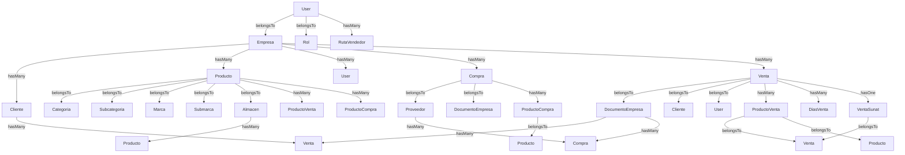

# Code Graph - ProjRoma

## 📊 Resumen del Proyecto
- **Nombre**: ProjRoma Facturación
- **Framework**: Laravel 12.58.0 (PHP 8.3)
- **Tipo**: Sistema de Facturación, Ventas y Almacén
- **Integración**: Sunat (Greenter), PDF/DomPDF, Excel, DataTables

---

## 🏗️ Arquitectura del Código

### Capas del Sistema

```
┌─────────────────────────────────────────────────────────────┐
│                    PRESENTACIÓN                            │
│  ┌─────────────┐  ┌─────────────┐  ┌─────────────────────┐ │
│  │   WEB       │  │   API       │  │   REPORTES          │ │
│  │   Routes    │  │   Routes    │  │   (PDF/Excel)       │ │
│  └─────────────┘  └─────────────┘  └─────────────────────┘ │
├─────────────────────────────────────────────────────────────┤
│                    NEGOCIO                                 │
│  ┌─────────────┐  ┌─────────────┐  ┌─────────────────────┐ │
│  │ Controllers │  │  Requests   │  │   Middleware        │ │
│  │             │  │  Validation │  │                     │ │
│  └─────────────┘  └─────────────┘  └─────────────────────┘ │
├─────────────────────────────────────────────────────────────┤
│                    DATOS                                   │
│  ┌─────────────┐  ┌─────────────┐  ┌─────────────────────┐ │
│  │   Models    │  │  Factories  │  │   Migrations        │ │
│  └─────────────┘  └─────────────┘  └─────────────────────┘ │
└─────────────────────────────────────────────────────────────┘
```

---

## 📦 Modelos y Relaciones

### Grafo de Relaciones de Modelos



---

## 📁 Estructura de Archivos

```
projRoma/
├── app/
│   ├── Http/
│   │   ├── Controllers/
│   │   │   ├── Api/
│   │   │   │   ├── VentasApiController.php
│   │   │   │   ├── ClientesApiController.php
│   │   │   │   ├── ProductosApiController.php
│   │   │   │   ├── ComprasApiController.php
│   │   │   │   ├── AlmacenApiController.php
│   │   │   │   ├── MovimientoApiController.php
│   │   │   │   ├── RecepcionApiController.php
│   │   │   │   ├── PrestamoApiController.php
│   │   │   │   ├── MotivoApiController.php
│   │   │   │   ├── SucursalApiController.php
│   │   │   │   ├── ArqueoApiController.php
│   │   │   │   ├── CatalogoApiController.php
│   │   │   │   └── ...
│   │   │   ├── Auth/LoginController.php
│   │   │   ├── Controller.php
│   │   │   ├── VentasController.php
│   │   │   ├── ComprasController.php
│   │   │   └── ...
│   │   ├── Middleware/
│   │   │   ├── CheckEmpresa.php
│   │   │   ├── SessionTimeout.php
│   │   │   └── SecurityHeaders.php
│   │   └── Requests/Ventas/GuardarVentaRequest.php
│   ├── Models/
│   │   ├── User.php, Cliente.php, Producto.php
│   │   ├── Venta.php, Compra.php, Cotizacion.php
│   │   ├── Empresa.php, Sucursal.php, Almacen.php
│   │   └── ...
│   ├── Providers/
│   │   ├── AppServiceProvider.php
│   │   └── RouteServiceProvider.php
│   └── Helpers/helpers.php
├── routes/
│   ├── api.php          # 143 endpoints
│   ├── web.php
│   └── console.php
├── database/
│   ├── migrations/
│   └── seeders/
├── public/
├── resources/
├── storage/
├── vendor/
└── config/
```

---

## 🔗 Flujos de Negocio

### 1. Flujo de Venta
```
[API Request] → VentasApiController::guardar()
              → Validar con GuardenVentaRequest
              → Crear Venta
              → Crear ProductosVenta
              → Actualizar Stock
              → Crear Pagos (DiasVenta)
              → Actualizar Cliente
              → Commit/Rollback
```

### 2. Flujo de Compra
```
[API Request] → ComprasApiController
              → Validar datos
              → Crear Compra
              → Crear ProductoCompra
              → Actualizar Stock
```

### 3. Flujo de Inventario
```
[API Request] → MovimientoApiController
              → Ingreso/Egreso de Productos
              → Actualizar Cantidad
              → Registrar Movimiento
```

---

## 📊 Métricas del Código

| Componente | Cantidad |
|------------|----------|
| Modelos    | 30+      |
| Controladores | 25+   |
| API Endpoints | 143   |
| Middleware | 4        |
| Requests   | 1+       |

---

## 🔍 Hallazgos Clave

1. **Arquitectura Limpia**: Separación clara entre API y Web
2. **Multi-Empresa**: Todos los modelos filtran por `id_empresa`
3. **Transacciones DB**: Uso de `DB::beginTransaction()` en operaciones críticas
4. **Sunat Integration**: Usa biblioteca `greenter/greenter`
5. **Reportes**: Soporte para PDF (domPDF) y Excel (maatwebsite/excel)
6. **Permisos**: `spatie/laravel-permission` para roles y permisos

---

## 🎯 Próximos Pasos

- [ ] Implementar caché para consultas frecuentes
- [ ] Agregar logging estructurado
- [ ] Optimizar consultas con Eager Loading
- [ ] Documentar APIs REST